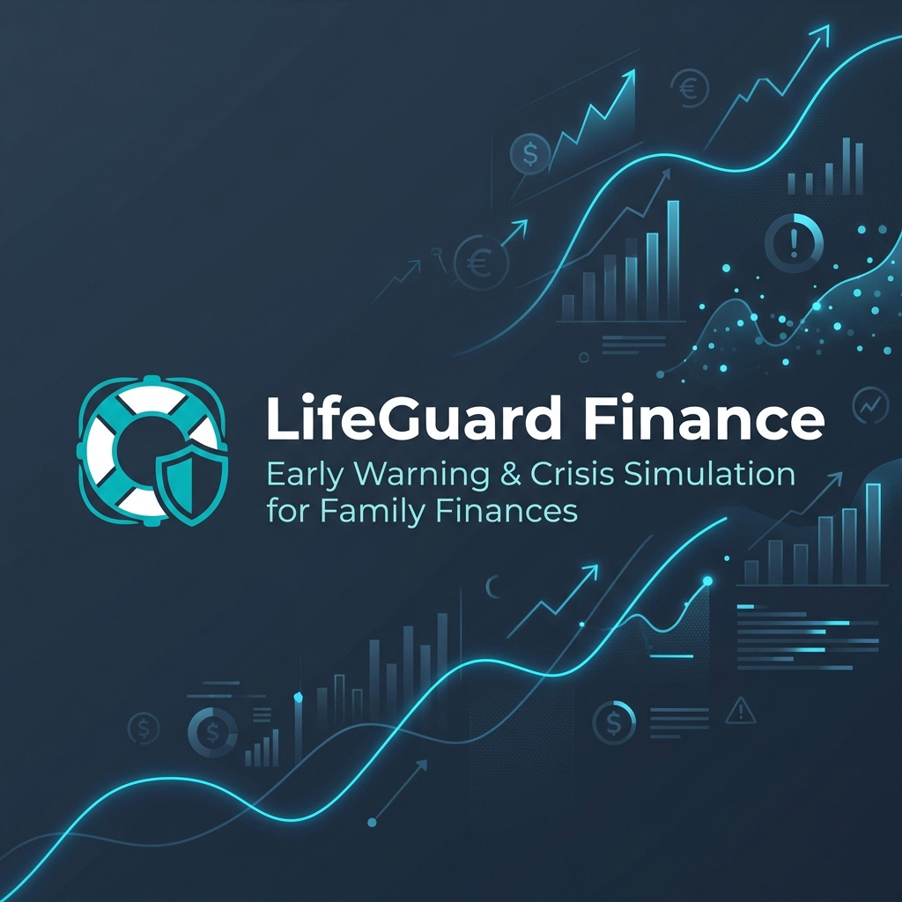

# LifeGuard Finance



## 🛡️ Early Warning System, Crisis Simulation, and Mitigation Guidance for Family Finances

**LifeGuard Finance** is a local-first mobile application designed to detect, simulate, and mitigate financial vulnerability in household and family environments. It computes the **Financial Vulnerability Score (FVS)** and provides custom actionable 30/60/90-day roadmaps to build long-term economic resilience.

---

## 🎨 Brand Color Palette & Design System

To ensure visual consistency across screens, dashboards, and visualizations, we adhere to the following color palette:

### 1. Brand Core Colors
*   **Primary (Slate Indigo - `#1E3A8A`)**: Represents trust, security, and stability.
*   **Secondary/Accent (Emerald Teal - `#0D9488`)**: Represents financial balance, growth, and sustainability.
*   **Primary Light (Electric Blue - `#3B82F6`)**: Used for active icons, indicator highlights, and focus borders.

### 2. Neutral UI System (Dark Theme)
*   **Background (`#0F172A`)**: Dark slate background to reduce eye strain.
*   **Surface Card (`#1E293B`)**: Muted slate for card elements and input backdrops.
*   **Text Primary (`#F8FAFC`)**: Clean off-white for maximum readability.
*   **Text Secondary (`#94A3B8`)**: Cool grey-blue for subtitles and descriptions.

### 3. FVS Risk Indicator Colors
Used to visually communicate the health status of FVS score metrics:
*   🟢 **Aman / Safe (`#10B981`)**: Score $\ge$ 70 (Green)
*   🟡 **Waspada / Warning (`#F59E0B`)**: Score 55 - 69 (Yellow)
*   🟠 **Rentan / Vulnerable (`#F97316`)**: Score 40 - 54 (Orange)
*   🔴 **Kritis / Critical (`#EF4444`)**: Score $<$ 40 (Red)

---

## 🚀 Key Features

*   **1. Detect (FVS Assessment)**: Multi-step questionnaire to map demographic and financial conditions, computing the aggregate FVS based on 7 indicators.
*   **2. Simulate (Crisis Sandbox)**: Interactive sliders to project the impact of Job Loss (PHK), Medical Shocks, Interest Hikes, and Inflation on monthly cash flow and survival runway.
*   **3. Guide (Action Plan)**: Auto-generated 30/60/90-day task checklist prioritizing emergency buffers, debt management, and protection policies.
*   **4. Privacy by Design (Local-First)**: Fully offline SQLite data persistence. Users can instantly purge all stored records directly from the settings.

---

## 🏗️ Technical Stack & Architecture

*   **Framework**: Flutter (Dart)
*   **State Management**: Flutter Riverpod
*   **Database**: SQLite (`sqflite` & `path` helper)
*   **UI/UX**: `flutter_animate` for transitions, `lucide_icons` for iconography.
*   **Structure**: **Feature-First** layout separating presentation, data, logic, and state providers.

---

## ⚙️ Getting Started

### Prerequisites
*   Flutter SDK (version $\ge$ 3.0)
*   Android Studio / Xcode (for emulation)

### Setup & Run
1. Clone the repository and navigate to the directory:
   ```bash
   git clone <repository_url>
   cd life_guard_finance
   ```
2. Get dependencies:
   ```bash
   flutter pub get
   ```
3. Run the application:
   ```bash
   flutter run
   ```
