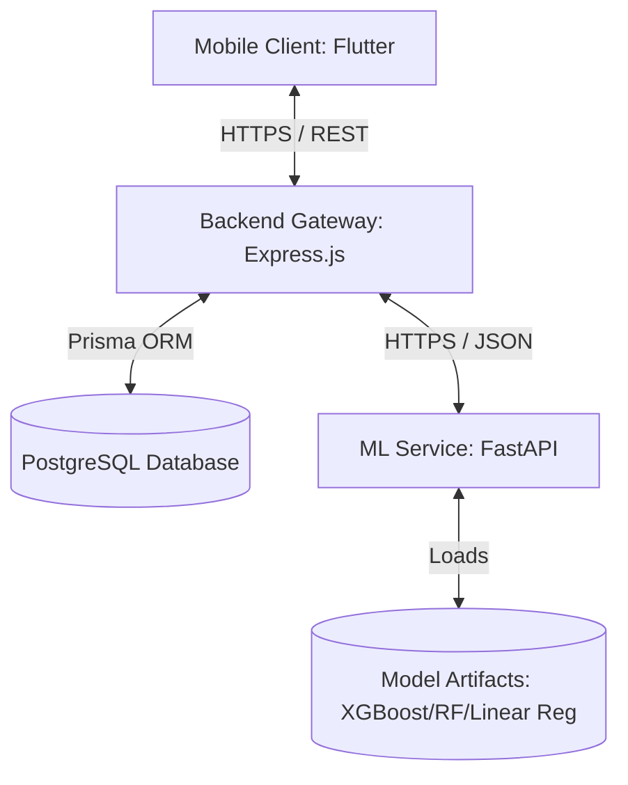

# 🛡️ LifeGuard Finance

[](https://flutter.dev)
[](https://nodejs.org)
[](https://fastapi.tiangolo.com)
[](https://www.postgresql.org)
[](https://firebase.google.com)

Welcome to the root repository of **LifeGuard Finance**—a mobile-first personal finance platform designed to empower users with real-time financial health monitoring, proactive budgeting insights, and AI-driven spending anomaly protection.

This repository is organized as a monorepo workspace containing the cross-platform mobile client, the core API gateway, and the machine learning forecasting engine.

---

## 📂 Workspace Structure

The project is divided into three isolated, specialized directories:

```text
lifeguard-finance/
├── Backend/           # Core API Gateway (Node.js + Express.js + Prisma)
│   ├── api/           # Vercel serverless entry points
│   ├── prisma/        # Database schema & migrations
│   └── src/           # Application logic
├── Frontend/          # Mobile Application Workspace
│   └── lifeguard_finance/  # Cross-platform Flutter Application
└── Machine-learning/  # AI models, forecasting & anomaly detection service (Python + FastAPI)
    ├── src/           # FVS calculation, ML models, & pipelines
    └── artifacts/     # Trained ML model weights
```

---

## 🏛️ System Architecture

LifeGuard Finance operates on an interconnected three-tier architecture designed for performance, modularity, and scalability:



### 1. The Client (Frontend)
Developed with **Flutter**, the mobile app ensures a premium cross-platform user experience.
* **State Management**: Separated clean logic using the **BLoC (Business Logic Component)** pattern.
* **Local Persistence**: **Hive** database handles lightning-fast offline cache and profiles.
* **Authentication**: **Firebase Auth** manages secure user signup, logins, and session lifecycles.

### 2. The Core (Backend API Gateway)
Powered by **Node.js** & **TypeScript** with **Express.js**.
* **ORM & Database**: Connects via **Prisma** to a relational **PostgreSQL** database.
* **Integration Adapter**: Mediates user requests and triggers the machine learning engine for real-time predictions.
* **Security**: Enforces route protection via Firebase JWT verification and role-based access control (RBAC).

### 3. The Intelligence (Machine Learning Service)
Built on **Python** with **FastAPI**.
* **FVS Calculation**: Implements a hybrid engine combining rule-based heuristics and trained regression models (XGBoost, Random Forest, Linear Regression).
* **Predictive Simulation**: Calculates inflation impact and models what-if emergency scenarios.
* **Real-Time Detection**: Automatically runs anomaly detection algorithms to identify suspicious transaction spikes.

---

## 🚀 Unified Quick Start Guide

To run the entire LifeGuard Finance ecosystem locally, execute services in the following order:

### Phase 1: Machine Learning Service
1. Navigate to `Machine-learning/`.
2. Set up your Python virtual environment and activate it:
   ```bash
   python -m venv venv
   # On Windows:
   .\venv\Scripts\activate
   # On macOS/Linux:
   source venv/bin/activate
   ```
3. Install dependencies:
   ```bash
   pip install -r requirements.txt
   ```
4. Copy the environment config:
   ```bash
   cp .env.example .env
   ```
5. Run the pipeline to train models and generate artifacts:
   ```bash
   python -m src.training.pipeline
   ```
6. Start the FastAPI server:
   ```bash
   python main.py
   ```
   *The ML service will start running on `http://localhost:8000`.*

---

### Phase 2: Backend API Gateway
1. Navigate to `Backend/`.
2. Install npm dependencies (using `pnpm` or `npm`):
   ```bash
   pnpm install
   ```
3. Copy environment configuration:
   ```bash
   cp .env.example .env
   ```
   *(Ensure `ML_SERVICE_URL` is set to `http://localhost:8000`)*
4. Generate Prisma Client, apply database migrations, and run seeds:
   ```bash
   pnpm prisma:generate
   pnpm prisma:migrate
   pnpm prisma:seed
   ```
5. Launch the development server:
   ```bash
   pnpm dev
   ```
   *The API will start running on `http://localhost:3000` with Swagger Docs at `/api/docs`.*

---

### Phase 3: Mobile Frontend (Flutter)
1. Navigate to `Frontend/lifeguard_finance/`.
2. Install Flutter packages:
   ```bash
   flutter pub get
   ```
3. Generate Hive Adapters using build runner:
   ```bash
   dart run build_runner build --delete-conflicting-outputs
   ```
4. Run the application on your target device/emulator:
   ```bash
   flutter run
   ```

---

## 🧪 Demo Account (For Evaluation)

We have pre-configured a demonstration account containing pre-populated transactions, savings goals, and family budgets. You can use these credentials to log in and evaluate all pages directly:

* **Email**: `juri@lifeguard.com`
* **Password**: `juri12345`

---

## 🔗 Directory Documentation Links

For component-specific configurations and development notes, refer to the respective manuals:
* 🖥️ [Backend API Guide](file:///C:/Users/maula/Documents/BANTAI%20LOMBA%20NASIONAL/Competition%20RAKERNAS%20IndoCEISS%202026/LifeGuard-Finance/Backend/README.md)
* 📱 [Frontend Setup Manual](file:///C:/Users/maula/Documents/BANTAI%20LOMBA%20NASIONAL/Competition%20RAKERNAS%20IndoCEISS%202026/LifeGuard-Finance/Frontend/README.md)
* 🧠 [ML Service Documentation](file:///C:/Users/maula/Documents/BANTAI%20LOMBA%20NASIONAL/Competition%20RAKERNAS%20IndoCEISS%202026/LifeGuard-Finance/Machine-learning/README.md)